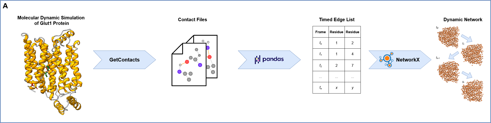
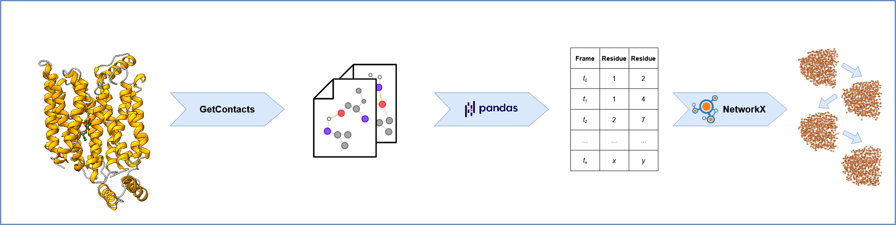
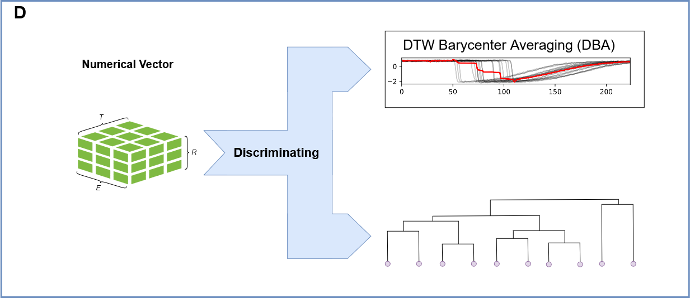

.. NetMD documentation master file, created by
   sphinx-quickstart on Mon Mar 10 10:58:18 2025.
   You can adapt this file completely to your liking, but it should at least
   contain the root `toctree` directive.

Welcome to NetMD's Documentation!
=================================

.. toctree::
   :maxdepth: 1
   :caption: Contents:

.. raw:: html

   

   

What is NetMD?
--------------

Molecular dynamics (MD) simulations are crucial for examining the structural and dynamic properties of biological systems. However, comparing multiple MD trajectories to identify common molecular patterns is challenging due to temporal misalignments. We present NetMD, a computational method that synchronizes MD trajectories using graph-embedding and dynamic time-warping techniques. NetMD allows researchers to better understand complex molecular interactions, revealing previously unidentified patterns and advancing fields from drug discovery to materials science.

Overview
--------

1. **Loading Molecular Dynamics (MD) Replica Files and Network Construction:**

   The process begins by loading multiple MD simulation trajectory files, each representing an indipent "replica" of the molecular system's evolution.
   For each frame within each replica, a network representation is constructed using NetworkX, where nodes correspond to atoms or residues, and edges represent interactions between them. This network captures the structural relationships at each time point.

.. image:: _static/img/workflow/workflow_B.png
   :alt: filtering NetMD Image
   :class: only-light

.. image:: _static/img/workflow/workflow_B_dark.png
   :alt: filtering NetMD Image
   :class: only-dark

2. **Preprocessing: Edge Filtering Based on Entropy:**

   To reduce noise and focus on significant interactions, each replica undergoes preprocessing.
   Intra-replica entropy is calculated for each edge, reflecting the variability of that interaction within the individual replica's trajectory.
   An inter-replica filter is then applied, removing edges with consistently low entropy across all replicas. This step ensures that only robust and relevant interactions are retained for further analysis.

.. image:: _static/img/workflow/workflow_C.png
   :alt: graph2vec NetMD Image
   :class: only-light

.. image:: _static/img/workflow/workflow_C_dark.png
   :alt: graph2vec NetMD Image
   :class: only-dark

3. **Graph2Vec Embedding: Transforming Networks into Time Series:**

   The preprocessed network representations are transformed into numerical embeddings using the Graph2Vec algorithm.
   By applying Graph2Vec to each frame, the dynamic evolution of the molecular system is represented as a time series of these embedding vectors.

.. image:: _static/img/workflow/workflow_D_dark.png
   :alt: alignment NetMD Image
   :width: 75%
   :align: center
   :class: only-dark

4. **Barycenter Calculation: Identifying the Central Trajectory:**

   To establish a reference trajectory, the barycenter of the embedded time series is computed.
   The barycenter represents the average or central trajectory, capturing the common dynamic features across all replicas. This serves as a basis for comparing and ranking the individual replicas.

5. **Ranking Time Series: Assessing Similarity to the Barycenter:**

   Each embedded time series is ranked based on its similarity to the calculated barycenter.
   This ranking is typically determined using the Dynamic Time Warping (DTW) distance, which accounts for temporal misalignments between trajectories.
   The replicas with the lowest DTW distance to the barycenter are considered the most similar, and therefore ranked higher.

6. **Hierarchical Clustering: Grouping Similar Trajectories:**

   Finally, hierarchical clustering is performed on the embedded time series to identify groups of replicas with similar dynamic behaviors.

.. raw:: html

   

Contents
--------

.. toctree::
   :maxdepth: 2

   installation
   quickstart
   quickstart_example
   quickstart_notebook
   manual