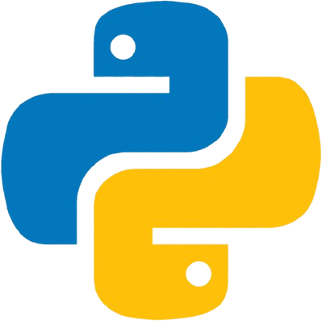

Installation
============

.. raw:: html

   

.. |Conda| raw:: html

    <a href="https://docs.conda.io/projects/conda/en/latest/user-guide/getting-started.html" target="_blank">1</a>

.. NetMD can be installed using Conda. 
.. For direct access to the source code and flexibility in development, users can clone the repository and install NetMD using `setup.py`. 
.. This method allows for customization and contributions. Alternatively, for a streamlined installation experience NetMD is also available as a Conda package. 

.. Choose the method that best suits your needs.

NetMD is available as a Conda[ |Conda| ] package and can be installed using the following command:
   
Installation via Conda 
----------------------

.. code-block:: console

   (env) $ conda install bfxcss::netmd -c conda-forge

Check if everything is fine

.. code-block:: console

   (env) $ netmd -h

.. .. |pythonlogo| Installation via `setup.py` 
.. -------------------------------------------

.. Firstly let's see the **help** section of NetMD:

.. .. code-block:: console

..    (env) $ python setup.py install 