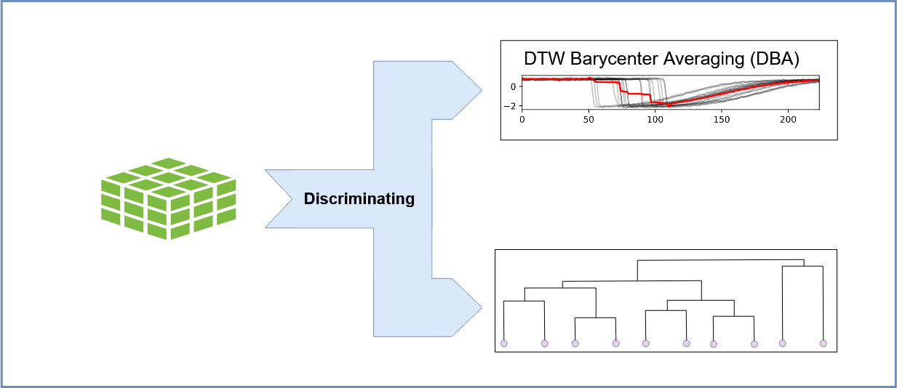

.. |tsv_logo| image:: _static/img/tsv_icon-removebg-preview.png
  :alt: Python Logo
  :width: 25
  :align: middle

.. |Graph2VeC| raw:: html

    <a href="https://karateclub.readthedocs.io/en/latest/_modules/karateclub/graph_embedding/graph2vec.html" target="_blank">1</a>

.. _manual:

Manual
======

.. raw:: html

   

NetMD employs computational method that synchronizes MD trajectories using graph-embedding and dynamic time-warping techniques, 
this allows researchers to better understand complex molecular interactions, revealing previously unidentified patterns. 

Here we define a more detailed manual of NetMD.

==============
Usage and Help 
==============

NetMD is a command-line tool that allows users to analyze molecular dynamics (MD) trajectories by synchronizing them using graph-embedding and dynamic time-warping techniques.
The program is designed to work with contact files generated from MD simulations, and it provides a comprehensive set of features for analyzing and visualizing the data.

To start the program you can use the following command:

.. code-block:: console

  (env) $ netmd -I INPUTPATH INPUTPATH -F FILES [FILES ...] -f FEATURES -e EDGEFILTER -c CONFIGFILE -o OUTPUTPATH -p / --plotFormat {svg,png} --verbose

Where the command line arguments are defined as:

- **-h, -\-help**

  Show the help message and exit.

- **-F FILES [FILES ...], -\-Files FILES [FILES ...]**  *(required)*

  Specify one or more contact file paths to be loaded.

- **-I INPUTPATH INPUTPATH, -\-InputPath INPUTPATH INPUTPATH**  *(required)*

  This option accepts two inputs: a directory tree for recursive exploration and a filename prefix shared by all contact files.
  The program will search for contact files with the specified prefix within the provided directory tree.

  **Example:**
  
  .. code-block:: bash
     
     -I ./examples/data FullReplica

- **-f FEATURES, -\-features FEATURES** *(optional)*

  Specify the path to the file containing node features. The file must be in tab-separated values (.tsv) format, the first column should be the residue number followed by the features columns.
  If no path is provided, the unique residue identifier in the contact file will be used as the node feature.

  **Example:**

  .. container:: small-table

    .. csv-table:: 
        :header: residue_number, feature_1, feature_2

        1,2.653,NZ
        2,3.851,NZ
        3,2.999,OE1
        4,3.729,OD1
        5,2.813,OE1
        6,3.654,OE1
        ..., ...

- **-e EDGEFILTER, -\-edgeFilter EDGEFILTER** *(optional)*

  Specify the entropy threshold used to filter the graph edges. *(default: 0.1)*

- **-c CONFIGFILE, -\-configFile CONFIGFILE** *(optional)*

  Specify the path to the configuration file containing arguments for Graph2Vec.
  If no path is provided, default values will be used.

- **-o OUTPUTPATH, -\-outputPath OUTPUTPATH** *(optional)*

  Specify the output path. If no path is provided, the ``results`` folder will be created.

- **-p, -\-plotFormat {svg,png}** *(optional)*

  Specify the format of the image output. *(svg, png; default: svg)*

- **-\-verbose** *(optional)*

  Allow extra prints to monitor progress.

================
Program Workflow
================

.. image:: _static/img/workflow/workflow_A.png
   :alt: load MD Image
   :class: only-light

.. image:: _static/img/workflow/workflow_A_dark.png
   :alt: load MD Image
   :class: only-dark

**1. Loading Molecular Dynamics (MD) Replica Files and Network Construction:**

The process begins by loading multiple MD simulation trajectory files, each representing a "replica" of the molecular system's evolution.
There are two way to pass the replica files to the program:

- ``iterate_replica_files``: Iterate trough the given path of the contact files.
- ``crawl_replica_files``: Recursively explore the given directory tree and search for contact files with a common prefix.

For each frame within each replica, a network representation is constructed using NetworkX, where nodes correspond to atoms or residues, and edges represent interactions between them. 
This network captures the structural relationships at each time point.

.. image:: _static/img/workflow/workflow_B.png
   :alt: filtering NetMD Image
   :class: only-light

**2. Preprocessing: Edge Filtering Based on Entropy:**

To reduce noise and focus on significant interactions, each replica undergoes preprocessing. During the loading process the ``load_data`` function is called, which computes the intra-replica entropy for each edge, reflecting the variability of that interaction within the individual replica's trajectory.
An inter-replica filter is then applied in ``entropy_filter``, removing edges with consistently low entropy across all replicas. This step ensures that only robust and relevant interactions are retained for further analysis.

**3. Graph2Vec Embedding: Transforming Networks into Time Series:**

Following preprocessing, network representations are fed into ``g2v_fit_transform``, 
leveraging Graph2Vec[|Graph2VeC|] to produce numerical embeddings. 
This embedding process translates the structural essence of each frame into a high-dimensional vector. 
Consequently, the molecular system's dynamic evolution is captured as a sequential series of these embedding vectors.

.. image:: _static/img/workflow/workflow_D.png
   :alt:  alignment NetMD Image
   :width: 75%
   :align: center
   :class: only-light

**4. Barycenter Calculation: Identifying the Central Trajectory:**

To establish a reference trajectory, the barycenter of the embedded time series is computed.
The barycenter represents the average or central trajectory, capturing the common dynamic features across all replicas. This serves as a basis for comparing and ranking the individual replicas.

**5. Ranking Time Series: Assessing Similarity to the Barycenter:**

Each embedded time series (representing a replica) is ranked based on its similarity to the calculated barycenter.
This ranking is typically determined using the Dynamic Time Warping (DTW) distance, which accounts for temporal misalignments between trajectories.
The replicas with the lowest DTW distance to the barycenter are considered the most similar, and therefore ranked higher.

**6. Hierarchical Clustering: Grouping Similar Trajectories:**

Finally, hierarchical clustering is performed on the embedded time series to identify groups of replicas with similar dynamic behaviors.
This clustering allows researchers to categorize the MD trajectories into distinct clusters, revealing common molecular patterns and identifying variations in the system's dynamics.
This step helps to visualize and understand the diversity of the MD simulations.

Throughout the execution, several plots and files are saved in the *out_path* specified.

-------------------------------
|matplot_logo| Plots Generated
-------------------------------

- **2D Plot of the Replica Embeddings**:
  Visual representation of the embeddings of all replicas.

- **2D Plot of the Replica Embeddings with Barycenter**:
  The embeddings with the barycenter overlaid.

- **Iterative Pruning Process Plot**:
  Visualization of the iterative pruning process used to refine the replicas.

- **Dendrogram Plot**:
  A dendrogram plot with a cut line computed using the elbow method, showing the hierarchical clustering results.

-------------------------
|tsv_logo| Files Created
-------------------------

- **metadata.tsv**:
  A DataFrame containing information about the replica and frame. Can be used to index the replica embeddings.

- **subgraphs_emb.pkl**:
  A list of subgraph embeddings belonging to different replicas.

- **dtw_matrix.tsv**:
  A squared matrix where each value represents the Euclidean distance between aligned time series.

- **dtw_mapping.txt**:
  This file contains the frame of each replica and the corresponding frame of the barycenter. It illustrates the dynamic time warping (DTW) indexing and the Euclidean distance between frames.

- **iterative_ranks.tsv**:
  A file containing the iterative pruning results of all replicas based on their distance from the barycenter.

===============
NetMD Reference
===============

This reference manual provides a detailed overview of the functions and classes used in the NetMD. 
We provide this manual to help users understand the functionality and underlying works of the program. 
The manual is organized into sections, each focusing on a specific function or class.

Data Loader
-----------

.. raw:: html

   

.. |create_parser_code| raw:: html

    <a href="https://github.com/mazzalab/NetMD/blob/main/netmd/main.py#L17" target="_blank"  style="font-family: monospace; font-size: 10px; color: blue;">source</a>

.. _create_parser_function:

-----------------
``create_parser``  
-----------------

|create_parser_code|

Function that builds the argument parser from the ``argparse`` library.

- **-h, -\-help**

  Show this help message and exit.

- **-I INPUTPATH INPUTPATH, -\-InputPath INPUTPATH INPUTPATH**  *(required)*

  Specify the directory tree path followed by the standardized prefix of the contact file name.
  
  **Example:**
  
  .. code-block:: bash
     
     -i examples_dir contacts.tsv

- **-F FILES [FILES ...], -\-Files FILES [FILES ...]**  *(required)*

  Specify one or more contact file paths.

- **-f FEATURES, -\-features FEATURES** *(optional)*

  Specify the path to the input file containing node features. The file must be in tab-separated values (.tsv) format.
  If no path is provided, the unique chain identifier of each residue in the contact file will be used as the node feature.

- **-e EDGEFILTER, -\-edgeFilter EDGEFILTER** *(optional)*

  Specify the entropy threshold used to filter the graph edges. *(default: 0.1)*

- **-c CONFIGFILE, -\-configFile CONFIGFILE** *(optional)*

  Specify the path to the configuration file containing arguments for Graph2Vec.
  If no path is provided, default values will be used.

- **-o OUTPUTPATH, -\-outputPath OUTPUTPATH** *(optional)*

  Specify the output path. If no path is provided, the ``results`` folder will be used.

- **-p / -\-plotFormat {svg,png}** *(optional)*

  Specify the format of the image output. *(svg, png; default: svg)*

- **-\-verbose** *(optional)*

  Allow extra prints.

**Returns**

	*argparse.ArgumentParser*
    	Object for parsing command-line strings into Python objects.

.. raw:: html

   

.. |check_entropy_code| raw:: html

    <a href="https://github.com/mazzalab/NetMD/blob/main/netmd/main.py#L47" target="_blank"  style="font-family: monospace; font-size: 10px; color: blue;">source</a>

-----------------
``check_entropy`` 
-----------------

|check_entropy_code|

Function that checks if the passed argument is a valid float between 0.0 and 1.0 (inclusive). If the argument does not meet the criteria, it raises an error.

**Parameters**

  *argument (str)*: 
  		A string representing the float that needs to be checked.

**Returns**

	*argument (str)*: 
  		The input argument is returned if it's a valid float between 0.0 and 1.0.

**Raises**

	*ValueError (argparse.ArgumentTypeError)*: 
		If the argument is not a valid float or is not within the specified range (0.0 to 1.0), an error is raised.

.. **Example Usage**

.. .. code-block:: python

..     check_entropy("0.5")  # Valid value, returns 0.5
..     check_entropy("1.2")  # Raises argparse.ArgumentTypeError
..     check_entropy("abc")  # Raises argparse.ArgumentTypeError

.. raw:: html

   

.. |iterate_replica_files_code| raw:: html

    <a href="https://github.com/mazzalab/NetMD/blob/main/netmd/dataLoader.py#L274" target="_blank"  style="font-family: monospace; font-size: 10px; color: blue;">source</a>

-------------------------
``iterate_replica_files`` 
-------------------------

|iterate_replica_files_code|

Iterates through the listed files, processes each file, and loads the resulting data.

This function takes a list of file paths, processes each file using the ``process_file``
function to extract relevant data, and then loads the extracted data into NetworkX graphs,
metadata DataFrames, and entropy DataFrames using the ``load_data`` function.

**Parameters**

  *file_list (list[str, ...])*: 
      List of files path. 

  *features_data (pd.DataFrame)*: 
    DataFrame containing features for each residue node.

  *verbose (bool)*: 
    Allow extra prints.

**Returns**
  
    *Tuple*: 
      containing: a list of *NetworkX* graphs, one for each frame in all processed files, 
      a *DataFrame* containing metadata about the frames, and a *DataFrame* containing the entropy of each edge across all processed files.

.. raw:: html

   

.. |crawl_replica_files_code| raw:: html

    <a href="https://github.com/mazzalab/NetMD/blob/main/netmd/dataLoader.py#L216" target="_blank"  style="font-family: monospace; font-size: 10px; color: blue;">source</a>

-----------------------
``crawl_replica_files`` 
-----------------------

|crawl_replica_files_code|

Recursively explores a directory to process contact files and construct network representations.

This function traverses a directory tree, identifies files with a specified prefix,
processes them using the `process_file` function to extract relevant data, and then loads the extracted data into NetworkX graphs,
metadata DataFrames, and entropy DataFrames using the `load_data` function.

**Parameters**

  *crawl_path (str)*: 
      The path to the directory to crawl.
  *file_prefix (str)*: 
      The prefix of the files to process.
  *features_data (pd.DataFrame)*: 
      DataFrame containing features for each residue node.
  *verbose (bool)*: 
      If True, prints information about loaded files.

**Returns**

  *Tuple*: 
    containing: a list of *NetworkX* graphs, one for each frame in all processed files, 
    a *DataFrame* containing metadata about the frames, and a *DataFrame* containing the entropy of each edge across all processed files.

.. raw:: html

   

.. |load_data_code| raw:: html

    <a href="https://github.com/mazzalab/NetMD/blob/main/netmd/dataLoader.py#L159" target="_blank"  style="font-family: monospace; font-size: 10px; color: blue;">source</a>

-------------
``load_data`` 
-------------

|load_data_code|

Constructs network representations of molecular dynamics frames and computes edge entropy.

This function takes contact data (residue interactions), optional node features, and a replica name
to generate a list of NetworkX graphs, metadata about the frames that is used to index the graph list, and the intra replica entropy of each edge.

**Parameters**

    *contacts_data (pd.DataFrame)*: 
        DataFrame with columns 'Frame', 'Res1', and 'Res2' representing residue contacts.
    *features_data (pd.DataFrame)*: 
        DataFrame containing features for each residue node (can be empty).
    *name (str)*: 
        The name of the replica.

**Returns**

    *Tuple*: 
        containing: a list of *NetworkX* graphs, one for each frame, a *DataFrame* with metadata about the frames (replica name, frame number), and
        a *DataFrame* containing the entropy of each edge.

.. raw:: html

   

.. |compute_entropy_code| raw:: html

    <a href="https://github.com/mazzalab/NetMD/blob/main/netmd/dataLoader.py#L131" target="_blank"  style="font-family: monospace; font-size: 10px; color: blue;">source</a>

-------------------
``compute_entropy`` 
-------------------

|compute_entropy_code|

Computes edge entropy for a given set of residue contacts. Each edge in the contact data is assigned an entropy value based on the probability of its presence.

**Parameters**

  *contacts_data (pd.DataFrame)*: 
      DataFrame with columns 'Frame', 'Res1', and 'Res2' representing residue contacts.

  **Returns**
    *df (pandas.DataFrame)*: 
        DataFrame containing the entropy value of each edge.

.. raw:: html

   

.. |process_file_code| raw:: html

    <a href="https://github.com/mazzalab/NetMD/blob/main/netmd/dataLoader.py#L68" target="_blank"  style="font-family: monospace; font-size: 10px; color: blue;">source</a>

----------------
``process_file`` 
----------------

|process_file_code|

Processes a contact file, extracting residue interaction information and preparing it for analysis.

This function reads a contact file, filters out comment lines and empty lines, extracts
the frame, interaction type, and atom identifiers, and then derives residue identifiers
from the atom identifiers. It then cleans and formats the data into a pandas DataFrame,
ready for further processing.

Specifically, the function performs the following steps:

1.  **File Reading and Initial Parsing:**
    * Reads the file line by line, skipping lines starting with '#' (comments) or empty lines.
    * Splits each line by tabs and extracts the first four columns: Frame, Interaction, Atom1, and Atom2.
2.  **DataFrame Creation and Initial Cleaning:**
    * Creates a pandas DataFrame from the extracted data.
    * Fills any missing values with 0.
    * Assigns column names: "Frame", "Interaction", "Atom1", "Atom2".
3.  **Residue Extraction:**
    * Extracts residue numbers from the "Atom1" and "Atom2" columns using regular expressions.
    * Converts the "Frame", "Res1", and "Res2" columns to integers.
4.  **Residue Ordering:**
    * Ensures that "Res1" is always less than or equal to "Res2" by swapping values if necessary. This creates consistent residue pairs.
5.  **Duplicate Removal and Reindexing:**
    * Removes duplicate rows based on "Frame", "Res1", and "Res2" columns.
    * Subtracts 1 from the residue numbers in "Res1" and "Res2" columns, effectively reindexing them.
6.  **Replica Name Extraction:**
    * Extracts the replica name from the file path.

**Parameters**

  *file_path (str)*: 
      The path to the contact file.

**Returns**

  *Tuple*: 
      containing: a *DataFrame* with columns "Frame", "Res1", and "Res2", representing residue interactions, and the *str* name of the replica, extracted from the file name.

.. raw:: html

   

.. |parse_config| raw:: html

    <a href="https://github.com/mazzalab/NetMD/blob/main/netmd/dataLoader.py#L13" target="_blank"  style="font-family: monospace; font-size: 10px; color: blue;">source</a>

----------------
``parse_config`` 
----------------

|parse_config|

Parses the *.yml* file containing all the required parameters for the graph embedding model. 
\nThe required arguments with their default values are:

* *wl_iterations*: Number of Weisfeiler-Lehman iterations. Default is 3.
* *use_node_attribute*: Name of graph attribute. Default is "feature".
* *dimensions*: Dimensionality of embedding. Default is 16.
* *workers*: Number of cores. Default is 1.
* *down_sampling*: Down sampling frequency. Default is 0.0.
* *epochs*: Number of epochs. Default is 10.
* *learning_rate* (HogWild): learning rate. Default is 0.025.
* *min_count*: Minimal count of graph feature occurrences. Default is 5.
* *seed*: Random seed for the model. Default is 42.
* *erase_base_features*: Erasing the base features. Default is False.

**Parameters**

  *config_path (str)*: 
      Path to the *.yml* file.

**Returns**
  
  *config (dict)*: 
      Dictionary containing all the arguments for the graph embedding model.

**Raises**

  *InvalidConfigurationError (Exception)*: 
      If the *.yml* file does not contain the expected arguments.

=========
Embedding
=========

.. raw:: html

   

.. |g2v_fit_transform_code| raw:: html

    <a href="https://github.com/mazzalab/NetMD/blob/main/netmd/embeddings.py#L16" target="_blank"  style="font-family: monospace; font-size: 10px; color: blue;">source</a>

.. |karateclub| raw:: html

    <a href="https://github.com/benedekrozemberczki/karateclub" target="_blank">karateclub</a>

.. |Graph2Vec| raw:: html

    <a href="https://arxiv.org/abs/1707.05005" target="_blank">Graph2Vec</a>

---------------------
``g2v_fit_transform``
---------------------

|g2v_fit_transform_code|

Fit the |Graph2Vec| model to the subgraphs and return the embeddings. Implementation from |karateclub|.

**Parameters**

  *g2v_config (Dict)*: 
      Configuration dictionary for Graph2Vec.
  *subgraphs (List[nx.Graph])*: 
      List of NetworkX graphs.

**Returns**

  *embeddings (np.ndarray)*: 
      Graph embeddings.

.. raw:: html

   

.. |entropy_filter| raw:: html

    <a href="https://github.com/mazzalab/NetMD/blob/main/netmd/embeddings.py#L41" target="_blank"  style="font-family: monospace; font-size: 10px; color: blue;">source</a>

------------------
``entropy_filter``
------------------

|entropy_filter|

Creates subgraphs from a list of graphs, including only edges that meet a specified entropy threshold.

This function filters edges based on their entropy values across multiple frames. Edges are
included in the subgraphs only if their entropy exceeds the given threshold in all replicas.

**Parameters**

  *graphs (list[networkx.Graph])*: 
      A list of NetworkX graphs.
  *entropies (pandas.DataFrame)*: 
      A DataFrame containing edge entropy values, where rows represent edges and columns represent frames.
  *treshold (float)*: 
      The entropy threshold value.

**Returns**

  *list[networkx.Graph]*: 
      A list of NetworkX subgraphs, each containing only the edges that meet the entropy threshold.

.. raw:: html

   

.. |dtw_mapping| raw:: html

    <a href="https://github.com/mazzalab/NetMD/blob/main/netmd/embeddings.py#L144" target="_blank"  style="font-family: monospace; font-size: 10px; color: blue;">source</a>

---------------
``dtw_mapping`` 
---------------

|dtw_mapping|

Performs Dynamic Time Warping (DTW) alignment between replicas and a barycenter, and saves the mapping.

This function aligns each replica's time series data with a barycenter using DTW. It then
generates a mapping that shows the alignment between frames in each replica and the barycenter,
and writes this mapping along with per-frame distances to a text file.

**Parameters**

  *replicas_ts (List[List[float]])*: 
      A 3D NumPy array containing the time series data for each replica. The shape should be (num_replicas, num_frames, feature_dim).
  *barycenter (np.ndarray)*: 
      A 2D NumPy array representing the barycenter time series. The shape should be (num_frames, feature_dim).
  *meta_data (pd.DataFrame)*: 
      A pandas DataFrame containing metadata about the replicas, including a 'Rep' column for replica names.
  *out_path (str)*: 
    The path to the output directory where the mapping file will be saved.

.. raw:: html

   

.. |iterative_pruning| raw:: html

    <a href="https://github.com/mazzalab/NetMD/blob/main/netmd/embeddings.py#L193" target="_blank"  style="font-family: monospace; font-size: 10px; color: blue;">source</a>

---------------------
``iterative_pruning`` 
---------------------

|iterative_pruning|

Iteratively removes a replica based on the greatest DTW distances, recalculating the barycenter
and scores at each step, until only one replica remains.

**Parameters**

  *replicas_ts (List[List[float]])*: 
      List of time series embeddings.
  *meta_data (pd.DataFrame)*: 
      Metadata DataFrame with replica and frame information.

**Returns**

  *Tuple*: 
      a *DataFrame* ranking all the replicas from worst to best and the *list* of barycenters calculated at each iteration.

.. raw:: html

   

.. |dim_reduction| raw:: html

    <a href="https://github.com/mazzalab/NetMD/blob/main/netmd/embeddings.py#L68" target="_blank"  style="font-family: monospace; font-size: 10px; color: blue;">source</a>

-----------------
``dim_reduction`` 
-----------------

|dim_reduction|

Performs dimensionality reduction on subgraph embeddings and a barycenter using PCA and Spectral Embedding.

This function first applies Principal Component Analysis (PCA) to reduce the dimensionality of
the subgraph embeddings while retaining 90% of the variance. If the resulting number of
components is less than 2, PCA is forced to reduce to 2 components. It then concatenates the
subgraph embeddings and the barycenter, transforms them using the fitted PCA, and applies
Spectral Embedding for further dimensionality reduction to 2 components.

**Parameters**

  *subgraph_emb (np.ndarray)*: 
      A NumPy array representing the subgraph embeddings.
  *barycenter (np.ndarray)*: 
      A NumPy array representing the barycenter embedding.
  *workers (int)*: 
      Number of workers that SpectralEmbedding is allowed to use.

**Returns**

    *transfomed_emb (np.ndarray)*: 
        A NumPy array representing the transformed embeddings after both PCA and Spectral Embedding.

.. raw:: html

   

.. |iterative_dim_reduction| raw:: html

    <a href="https://github.com/mazzalab/NetMD/blob/main/netmd/embeddings.py#L103" target="_blank"  style="font-family: monospace; font-size: 10px; color: blue;">source</a>

---------------------------
``iterative_dim_reduction`` 
---------------------------

|iterative_dim_reduction|

Performs iterative dimensionality reduction on subgraph embeddings and a series of barycenters.

This function applies PCA and Spectral Embedding to reduce the dimensionality of subgraph
embeddings and each barycenter in a given list. It first fits PCA to the subgraph embeddings,
ensuring at least 2 components are retained. Then, for each barycenter, it concatenates the
subgraph embeddings with the barycenter, transforms them using the fitted PCA, and applies
Spectral Embedding for further dimensionality reduction to 2 components.

**Parameters**

  *subgraph_emb (np.ndarray)*: 
      A NumPy array representing the subgraph embeddings.
  *barycenters (np.ndarray)*: 
      A NumPy array containing a list of barycenters.
  *workers (int)*: 
      Number of workers that SpectralEmbedding is allowed to use.

**Returns**

  *List[np.ndarray]*: 
      A list of NumPy arrays, where each array represents the transformed embeddings (subgraphs + barycenter) after both PCA and Spectral Embedding.

==========
Clustering
==========

.. raw:: html

   

.. |compute_dtwmatrix| raw:: html

    <a href="https://github.com/mazzalab/NetMD/blob/main/netmd/clustering.py#L46" target="_blank"  style="font-family: monospace; font-size: 10px; color: blue;">source</a>

---------------------
``compute_dtwmatrix`` 
---------------------

|compute_dtwmatrix|

Computes a Dynamic Time Warping (DTW) distance matrix for a set of time series.

This function calculates the pairwise DTW distances between all time series in the input array.
The resulting distance matrix is returned as a pandas DataFrame.

**Parameters**

  *replica_ts (List[List[float]])*: 
      A list containing the time series data. The shape is (num_frames, feature_dim).
  *meta_data (pd.DataFrame)*: 
      A pandas DataFrame containing metadata about the time series, including a 'Rep' column for replica names.

**Returns**

  *pd.DataFrame*: 
      A pandas DataFrame representing the DTW distance matrix. The index and columns are the unique replica names from the meta_data DataFrame.

.. raw:: html

   

.. |normalized_dtw| raw:: html

    <a href="https://github.com/mazzalab/NetMD/blob/main/netmd/clustering.py#L32" target="_blank"  style="font-family: monospace; font-size: 10px; color: blue;">source</a>

------------------
``normalized_dtw`` 
------------------

|normalized_dtw|

Computes the normalized distance between two time series using Dynamic Time Warping (DTW).

**Parameters**

  *ts1 (List[float])*: 
      The first time series.
  *ts2 (List[float])*: 
      The second time series.

**Returns**

  *float*: 
      The normalized DTW distance between the two time series.

.. raw:: html

   

.. |hierarchical_clustering_rank| raw:: html

    <a href="https://github.com/mazzalab/NetMD/blob/main/netmd/clustering.py#L133" target="_blank"  style="font-family: monospace; font-size: 10px; color: blue;">source</a>

--------------------------------
``hierarchical_clustering_rank`` 
--------------------------------

|hierarchical_clustering_rank| 

Performs hierarchical clustering on a DTW distance matrix and ranks replicas based on cluster assignments.

This function takes a DTW distance matrix, performs hierarchical clustering using Ward's linkage,
determines an optimal cluster cut using the elbow method, plots the dendrogram, and assigns
replicas to clusters. It then returns a dictionary mapping replica names to their cluster IDs.

**Parameters**

  *dtw_matrix_df (pd.DataFrame)*: 
      A pandas DataFrame representing the DTW distance matrix.
  *out_path (str)*: 
      The path to the output directory for saving the dendrogram plot.
  *plot_format (str)*: 
      The file format for saving the plot (e.g., 'png', 'pdf').
  *verbose (bool)*: 
      If True, enables verbose output (e.g., printing cluster information).

**Returns**

  *Dict*: 
      A dictionary mapping replica names to their cluster IDs.

.. raw:: html

   

.. |elbow_method_cut| raw:: html

    <a href="https://github.com/mazzalab/NetMD/blob/main/netmd/clustering.py#L13" target="_blank"  style="font-family: monospace; font-size: 10px; color: blue;">source</a>

--------------------------------
``elbow_method_cut`` 
--------------------------------

|elbow_method_cut| 

Extract from teh linkage matrix the largest gap between distances to find the elbow point.

**Parameters**

  *linkage_matrix (np.ndarray)*: 
      The linkage matrix from hierarchical clustering.

**Returns**

  *float*: 
      The index of the elbow point.

.. raw:: html

   

.. |map_link_to_data| raw:: html

    <a href="https://github.com/mazzalab/NetMD/blob/main/netmd/clustering.py#L80" target="_blank"  style="font-family: monospace; font-size: 10px; color: blue;">source</a>

--------------------
``map_link_to_data`` 
--------------------

|map_link_to_data| 

Maps the linkage matrix from hierarchical clustering to the original data points (replica names).

This function takes a linkage matrix produced by hierarchical clustering and a list of replica
names, and it constructs a dictionary that maps each step of the clustering process to the
corresponding clusters of data points.

**Parameters**

  *linkage_matrix (np.ndarray)*:
      A NumPy array representing the linkage matrix from hierarchical clustering.
  *rep_names (np.ndarray)*: 
      A NumPy array containing the original replica names.

**Returns**

  *Dict*: 
      A dictionary where keys are the step indices of the linkage matrix, and values are lists of two clusters (each cluster is a list of replica names) merged at that step.

==========
Plot Utils
==========

.. raw:: html

   

.. |plot_emb_rep| raw:: html

    <a href="https://github.com/mazzalab/NetMD/blob/main/netmd/plotUtils.py#L15" target="_blank"  style="font-family: monospace; font-size: 10px; color: blue;">source</a>

--------------------
``plot_emb_rep`` 
--------------------

|plot_emb_rep| 

Plots the 2D embeddings of replicas, colored by replica and frame.

This function generates two scatter plots: one showing the embeddings colored by replica,
and the other showing the embeddings colored by frame number.

**Parameters**

  *emb_subg (np.ndarray)*: 
      A NumPy array containing the 2D embeddings of subgraphs.
  *meta_data (pd.DataFrame)*: 
      A pandas DataFrame containing metadata about the embeddings.
  *out_path (str)*: 
      The path to the output directory where the plot will be saved.
  *plot_format (str)*: 
      The file format for saving the plot (e.g., 'png', 'pdf').

.. raw:: html

   

.. |plot_emb_bary| raw:: html

    <a href="https://github.com/mazzalab/NetMD/blob/main/netmd/plotUtils.py#L74" target="_blank"  style="font-family: monospace; font-size: 10px; color: blue;">source</a>

--------------------
``plot_emb_bary`` 
--------------------

|plot_emb_bary| 

Plots the 2D embeddings of the barycenter, showing both points and a line representation.

This function generates a figure with two subplots. The first subplot displays the barycenter points
as scatter points, while the second subplot connects the points with a line, visualizing the
trajectory of the barycenter embedding.

**Parameters**

  *emb_data (np.ndarray)*: 
      A NumPy array containing the 2D embeddings of the data, including the barycenter.
  *meta_data (pd.DataFrame)*: 
      A pandas DataFrame containing metadata about the embeddings, including 'Rep' (replica name) and 'Frame' columns.
  *out_path (str)*: 
      The path to the output directory where the plot will be saved.
  *plot_format (str)*: 
      The file format for saving the plot (e.g., 'png', 'pdf').

.. raw:: html

   

.. |plot_pruning| raw:: html

    <a href="https://github.com/mazzalab/NetMD/blob/main/netmd/plotUtils.py#L238" target="_blank"  style="font-family: monospace; font-size: 10px; color: blue;">source</a>

--------------------
``plot_pruning`` 
--------------------

|plot_pruning| 

Plots the iterative pruning process, showing the embeddings of replicas and barycenters at each step.

This function visualizes the iterative pruning of replicas. It generates a grid of subplots,
where each subplot represents a step in the pruning process. It plots the embeddings of the
remaining replicas and the barycenter at each step, using distinct colors for each replica.

**Parameters**

  *subgraphs_emb (List[List[float]])*: 
      A list containing the embeddings of subgraphs for each replica.
  *barycenters (np.ndarray)*: 
      A NumPy array containing the barycenters calculated at each step.
  *meta_data (pd.DataFrame)*: 
      A pandas DataFrame containing metadata about the embeddings.
  *replica_ranks (pd.DataFrame)*: 
      A pandas DataFrame containing the ranking of replicas.
  *out_path (str)*: 
      The path to the output directory where the plot will be saved.
  *plot_format (str)*: 
      The file format for saving the plot (e.g., 'png', 'pdf').
  *workers (int)*: 
      Number of workers that SpectralEmbedding is allowed to use.

.. raw:: html

   

.. |plot_dendogram| raw:: html

    <a href="https://github.com/mazzalab/NetMD/blob/main/netmd/plotUtils.py#L337" target="_blank"  style="font-family: monospace; font-size: 10px; color: blue;">source</a>

--------------------
``plot_dendogram`` 
--------------------

|plot_dendogram| 

Plots a dendogram based on the hierarcical clustering linkage matrix.
The dendrogram is colored based on the clusters formed at a specific cut distance. 

**Parameters**

  *linkage_matrix (np.ndarray)*: 
      The linkage matrix obtained from hierarchical clustering.
  *cut_distance_elbow (int)*: 
      The index of the cut distance to be used for coloring clusters.
  *replica_names (np.ndarray)*: 
      The names of the replicas.
  *out_path (str)*: 
      The path to save the dendrogram plot.
  *plot_format (str)*: 
      The file format for saving the plot (e.g., 'png', 'pdf').
