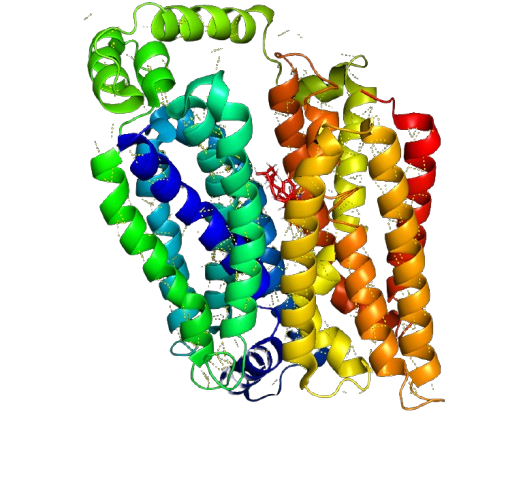
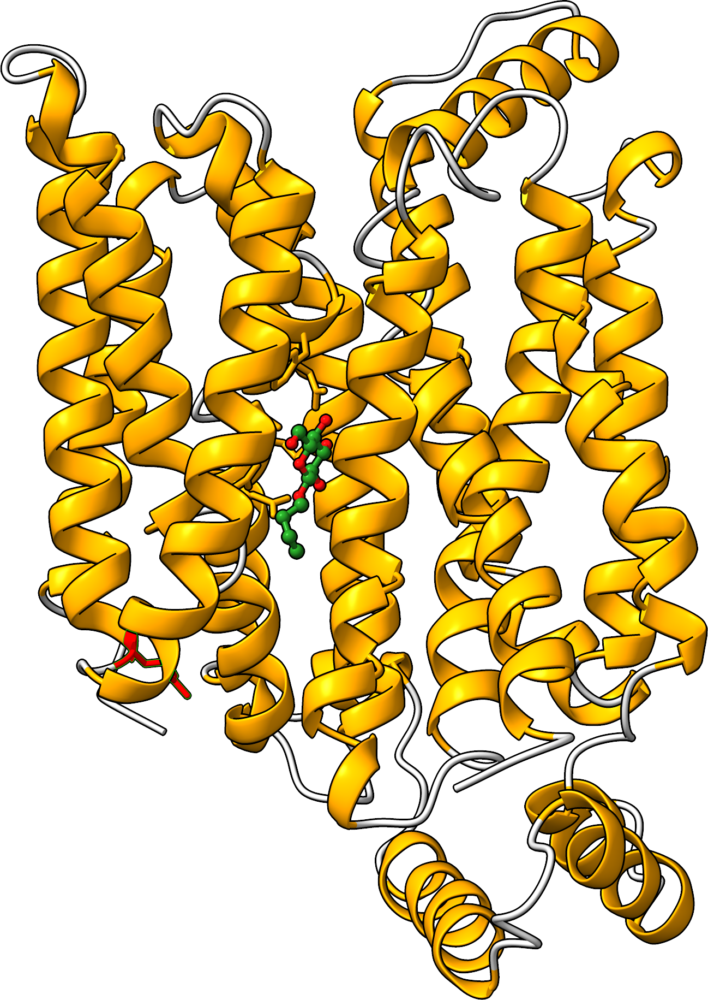

.. |GetContacts| raw:: html

    <a href="https://getcontacts.github.io" target="_blank">GetContacts</a>

.. |GetContacts_github| raw:: html
    
    <a href="https://github.com/getcontacts/getcontacts" target="_blank">GitHub page</a>

.. |config_file| raw:: html
    
    <a href="https://github.com/mazzalab/NetMD/blob/main/conf/config_g2v.yml" target="_blank">config_g2v.yml</a>

.. |github_netmd| raw:: html
    
    <a href="https://github.com/mazzalab/NetMD" target="_blank">NetMD's GitHub page</a>
  
.. |SuMD_ref| raw:: html
    
    <a href="https://doi.org/10.1007/978-1-4939-8630-9_17" target="_blank">1</a>

.. |dtw_ref| raw:: html
    
    <a href="https://tslearn.readthedocs.io/en/stable/user_guide/dtw.html" target="_blank">2</a>

.. |notebook| raw:: html
    
    <a href="https://github.com/mazzalab/NetMD/blob/main/tutorial/netmd_notebook.ipynb" target="_blank">NetMD Notebook</a>

.. _quickstart_example:

Quickstart by Example
======================

.. raw:: html

   

==============
NetMD Example 
==============

We present a practical example to demonstrates NetMD's workflow, from start to finish, using a real-world dataset.

The study involves the conformational transition of the **GLUT1** protein from the `outward-open` to the `inward-open` state a process closely linked to the glucose transport pathway. Here, we characterized the conformational transition of the **R333Q** ("Arg333Gln") mutant GLUT1, 
starting from outward-open conformations with glucose bound in its pocket, obtained through multiple Supervised Molecular Dynamics (SuMD [|SuMD_ref|]) simulations. 
Using a Targeted Molecular Dynamics (TMD) approach, we then gradually guided the glucose toward the cytoplasmic side. 

To ensure an accurate representation of these major conformational changes, we performed simulations with **eight independent replicas**.

All the files related to this example are located in the ``example`` directory of the NetMD repository.

|

1.  **Get MD Contacts**:
-------------------------

First the residue-residue contacts need to be extracted from the raw MD data of each replica. In this example we already have the residue-residue contacts extracted from the MD trajectories with |GetContacts| by using the following command line:

.. code-block:: console

   (env) $ python3 get_dynamic_contacts.py  --topology topology_2.pdb \
                                            --trajectory r333q_2.xtc \
                                            --stride 1 \
                                            --cores 6 \
                                            --sele "protein" \
                                            --sele2 "protein" \
                                            --itypes all \
                                            --output FullReplica2_r333q.tsv

This will produce a *tsv* file containing the residue-residue contacts for your trajectory. Here a small snippet of the output file:

.. container:: scrollable-table

  .. csv-table:: 
      :header: frame, interaction_type, atom_1, atom_2[\, atom_3[\, atom_4]], distance_1-2

      0,sb,X:GLU:213:OE1,X:LYS:237:NZ,2.653
      0,sb,X:ASP:176:OD2,X:LYS:175:NZ,3.851
      0,sb,X:ARG:241:NH1,X:GLU:238:OE1,2.999
      0,sb,X:ARG:224:NH2,X:ASP:232:OD1,3.729
      0,sb,X:ARG:215:NH2,X:GLU:212:OE1,2.813
      0,sb,X:ARG:326:NH2,X:GLU:446:OE1,3.654
      0,sb,X:ARG:204:NH1,X:GLU:239:OE1,3.853
      0,sb,X:ARG:204:NH1,X:GLU:239:OE2,2.773
      0,sb,X:ARG:204:NH2,X:GLU:239:OE1,3.772
      0,sb,X:ARG:204:NH2,X:GLU:239:OE2,2.991
      0,sb,X:ASP:176:OD1,X:LYS:175:NZ,2.590
      0,sb,X:ASP:232:OD2,X:HSD:231:ND1,2.877
      ..., ..., ..., ..., ...

For more information on refer to the GetContacts |GetContacts_github|.

|

2.  **Launch NetMD**:
-----------------------

Launch NetMD by providing the required input files. You can either list files directly on the command line or specify a directory and prefix for recursive exploration.

.. tab:: Sequence of Files

  .. code-block:: console

    (env) $ netmd -F FullReplica2_r333q.tsv FullReplica3_r333q.tsv FullReplica4_r333q.tsv FullReplica5_r333q.tsv FullReplica7_r333q.tsv FullReplica8_r333q.tsv FullReplica9_r333q.tsv FullReplica10_r333q.tsv -o ./results -e 0.1 -c config_g2v.yml --verbose

  NetMD will iterate over the list of files and generate the embeddings for each one using the set parameters. The |config_file| file contains the arguments for Graph2VeC:

.. tab:: Directory Tree

  .. code-block:: console

    (env) $ netmd -I tutorial/GLUT1_R333Q FullReplica -o ./results -e 0.1 -c config_g2v.yml --verbose

  
  NetMD will recursivly explore the directory tree starting from ``R333Q`` and generate the embeddings for each file with the prefix `FullReplica`. The |config_file| file contains the arguments for Graph2Vec:

  .. note::

    The ``-I`` option will only work if the input files are in the same directory. If you have files in different directories, you can use the ``-F`` option to specify them.

To learn more about the available command line options:

.. code-block:: console

   (env) $ netmd -h

|

3. **Analyze Results**:
------------------------

.. The results are stored in the ``example`` folder in the |github_netmd|, which contains a set of files that facilitates the analytical process. 

In this section, we will provide a brief overview of the most important files generated by NetMD. 

* **Embeddings for each MD replica frame.**

  .. figure:: _static/img/Glut1R333Q/replica_embedding.svg
    :alt: replica embedding 
    :width: 100%
    :align: center

  From the first plot, we can see the embeddings of each frame of the eight replicas projected on two dimesion. The model is able to reconstruct distinct trajectories with the correct temporal order. From the shape of the plot it can be observed the the effect of the TMD approach, which guides the conformation of the system to a desired and shared state.
  The replicas mainly differ in the inter states between *outward-open* and *inward-open*. To find a common consensus of the replicas, we can use the barycenter of the embeddings.

  | 

  .. figure:: _static/img/Glut1R333Q/barycenter_embedding.svg
    :alt: replica embedding with batycenter
    :width: 100%
    :align: center

  The second plot shows the barycenter of the embeddings, which minimizes the sum of squared distances to the time series of the eight replicas.

|

* **The filtered graph representation used to generate the embeddings.**

.. raw:: html

   

       
   

To facilitate further analysis and enable users to explore the data beyond the generated embeddings, 
we also provide access to the underlying graph structures themselves. 

These saved graphs have already been processed using the entropy filter. 
Each node is annotated with its corresponding residue number, linking it directly back to the protein's primary sequence.

|

* **The dynamic time warping (DTW) mapping between the frames and the barycenter.**

This output illustrates the synchronization of the potentially time-shifted or rate-varying trajectories by aligning each one to a common reference timeline, 
known as a barycenter, which represents an average or consensus trajectory. The alignment itself is achieved using the robust **Dynamic Time Warping** (DTW) [|dtw_ref|] algorithm. 

The table contains the mapping detailing which frame in the replica corresponds to which frame in the calculated barycenter, along with the calculated DTW distance. 
This allows for a comprehensive understanding of the alignment process and the degree of similarity between the trajectories and the barycenter.

.. container:: scrollable-table-dtw

  .. csv-table:: 

    <FullReplica2_r333q.tsv>,  0,  1,  2,  3,  4,  5,  6,  7,  8,  9, 10, 11, 12, 13, 14, 15, 16, 17, 18, 19, 20, 21, 22, 23, 24, 25, 26, 27, 28, 29, 30, 31, 32, 33, 34, 35, 36, 37, 38, 39, 40, 41, 42, 43, 44, 45, 46, 47, 48, 49, 50, 51, 52, 53, 54, 55, 56, 57, 58, 59, 60, 61, 62, 63, 64, 65, 66, 67, 68, 69, 70, 71, 72, 73, 74, 75, 76, 77, 78, 79, 80, 81, 82, 83, 84, 85, 86, 87, 88, 89, 90, 91, 92, 93, 94, 95, 96, 97, 98, 99,100,101,102,103,104,105,106,107,108,109,110,111,112,113,114,115,116,117,118,119,120,121,122,123,124,125,126,127,128,129,130,131,132,133,134,135,136,137,138,139,140,141,142,143,144,145,146,147,148,149,150,151,152,153,154,155,156,157,158,159,160,161,162,163,164,165,166,167,168,169,170,171,172,173,174,175,176,177,178,179,180,181,182,183,184,185,186,187,188,189,190,191,192,193,194,195,196,197,198,199,200,201,202,203,204,205,206,207,208,209,210,211,212,213,214,215,216,217,218,219,220,221,222,223,224,225,226,227,228,229,230,231,232,233,234,235,236,237,238,239,240,241,242,243,244,245,246,247,248,249,250,251,252,253,254,255,256,257,258,259,260,261,262,263,264,265,266,267,268,269,270,271,272,273,274,275,276,277,278,279,280,281,282,283,284,285,286,287,288,289,290,291,292,293,294,295,296,297,298,299,300,301,302,303,304,305,306,307,308,309,310,311,312,313,314,315,316,317,318,319,320,321,322,323,324,325,326,327,328,329,330,331,332,333,334,335,336,337,338,339,340,341,342,343,344,345,346,347,348,349,350,351,352,353,354,355,356,357,357,358,359,360,361,362,363,364,365,366,367,368,369,370,371,372,373,374,375,376,377,378,379,380,381,382,383,384,385,386,387,388,389,390,391,392,393,394,395,396,397,398,399,400,401,402,403,404,405,406,407,408,409,410,411,412,413,414,415,416,417,418,419,420,421,422,423,424,425,426,427,428,429,430,431,432,433,434,435,436,437,438,439,440,441,442,443,444,445,446,447,448,449,450,451,452,453,454,455,456,457,458,459,460,461,462,463,464,465,466,467,468,469,470,471,472,473,474,475,476,477,478,479,480,481,482,483,484,485,486,487,488,489,490,491,492,493,494,495,496,497,498,499
    <barycenter>,  0,  1,  2,  3,  4,  5,  6,  7,  8,  9, 10, 11, 12, 13, 14, 15, 16, 17, 18, 19, 20, 21, 22, 23, 24, 25, 26, 27, 28, 29, 30, 31, 32, 33, 34, 35, 36, 37, 38, 39, 40, 41, 42, 43, 44, 45, 46, 47, 48, 49, 50, 51, 52, 53, 54, 55, 56, 57, 58, 59, 60, 61, 62, 63, 64, 65, 66, 67, 68, 69, 70, 71, 72, 73, 74, 75, 76, 77, 78, 79, 80, 81, 82, 83, 84, 85, 86, 87, 88, 89, 90, 91, 92, 93, 94, 95, 96, 97, 98, 99,100,101,102,103,104,105,106,107,108,109,110,111,112,113,114,115,116,117,118,119,120,121,122,123,124,125,126,127,128,129,130,131,132,133,134,135,136,137,138,139,140,141,142,143,144,145,146,147,148,149,150,151,152,153,154,155,156,157,158,159,160,161,162,163,164,165,166,167,168,169,170,171,172,173,174,175,176,177,178,179,180,181,182,183,184,185,186,187,188,189,190,191,192,193,194,195,196,197,198,199,200,201,202,203,204,205,206,207,208,209,210,211,212,213,214,215,216,217,218,219,220,221,222,223,224,225,226,227,228,229,230,231,232,233,234,235,236,237,238,239,240,241,242,243,244,245,246,247,248,249,250,251,252,253,254,255,256,257,258,259,260,261,262,263,264,265,266,267,268,269,270,271,272,273,274,275,276,277,278,279,280,281,282,283,284,285,286,287,288,289,290,291,292,293,294,295,296,297,298,299,300,301,302,303,304,305,306,307,308,309,310,311,312,313,314,315,316,317,318,319,320,321,322,323,324,325,326,327,328,329,330,331,332,333,334,335,336,337,338,339,340,341,342,343,344,345,346,347,348,349,350,351,352,353,354,355,356,357,358,359,360,360,361,362,363,364,365,366,367,368,369,370,371,372,373,374,375,376,377,378,379,380,381,382,383,384,385,386,387,388,389,390,391,392,393,394,395,396,397,398,399,400,401,402,403,404,405,406,407,408,409,410,411,412,413,414,415,416,417,418,419,420,421,422,423,424,425,426,427,428,429,430,431,432,433,434,435,436,437,438,439,440,441,442,443,444,445,446,447,448,449,450,451,452,453,454,455,456,457,458,459,460,461,462,463,464,465,466,467,468,469,470,471,472,473,474,475,476,477,478,479,480,481,482,483,484,485,486,487,488,489,490,491,492,493,494,495,496,497,498,499
    <score>, 0.9552418949870151,0.7056661364711659,1.0405166074236338,1.1103355732502818,0.999316967507964,1.152765494228907,0.9950657540118084,0.9864373231526871,0.6597906067064832,1.0866071305749632,1.2834324215631776,1.0679416369024595,0.9988338645147402,0.8798720877540708,0.7727181248919861,0.9681168362171071,0.9235623052426903,0.9441237515175496,0.7303320415785013,1.1485883699342072,0.7224060582374318,0.923985101591425,0.8299610178430465,0.9779619117747534,0.8501586971999537,0.9358792935691772,1.1219734192343451,1.058837366279258,0.9568631576314547,0.9972336685338964,1.1579223845904285,1.296454261001924,1.012354187540849,1.0491462046861473,0.9114328614576067,0.9030529708696786,0.9960154424164906,0.6886467114665259,0.9941404466373173,0.723563128373342,1.004733066230999,0.9103943538192742,0.9439863000278155,0.943004411837038,0.8990881764627008,1.076600638423869,1.1845736657927812,1.2313508589180095,0.9384855373590083,0.8040155135225092,0.7065687257856562,0.5914965464435323,1.0615649439534312,0.9659994812498086,0.9600742860229925,0.7248816286605031,1.0839022431024512,0.9303555227562722,0.9850689949966652,0.7528632972574044,1.1065326337800385,0.5835338335625908,0.9432788228276621,0.8195552795399178,1.0080085371892527,0.7073343459962251,1.015169200908876,0.9567431827394028,1.0168164214807573,0.8553490907499207,0.9661962948380132,0.9013086862794439,0.9978949329067855,0.9877341695131245,1.01095296177873,0.741803576873521,0.9089097948114733,0.839510186957209,1.0029519269042662,1.0162240591194702,1.2777956466623546,0.9496037798776863,0.7263091600699857,1.1209704932690563,1.149229173080566,0.8599728229130773,0.9313856162600072,0.917565536035342,1.0912348042000002,0.962152153406639,1.2807604776691448,1.0758027950437188,1.1142882618919092,0.8903252709320956,0.7836312763315567,0.8846021436295325,0.9462656124959407,0.8460931678273204,1.1033186017998244,0.7309161531930822,1.0534524691971479,0.9514277402782155,0.7849936268711737,0.9095816318914675,0.764195938301092,1.1331600152871129,0.656139255741623,1.0701161968626542,1.0791849847687998,0.7982814709011181,0.8712553916258382,0.5729600701961672,1.0143283414782507,0.7754173933284785,0.6749208098428713,0.9283096711681847,0.7589957707820612,0.5784716191250493,0.8358414771456139,0.8029508106009203,0.845545424797329,0.8210906874061782,0.8662576224487255,1.0161728088873365,0.9773556174692274,0.8345959049273624,1.0731704148647314,0.6881690064467768,0.7675804101779053,0.960126468093403,0.9215936403394673,1.1251970060045073,1.025769196316695,1.2745210675796241,0.9397835438759394,0.8887933014107328,1.040962935275354,0.8914328477116558,1.0026059997819747,1.0052644201061136,0.8988527059855188,0.9819791102647805,0.8885782345780455,0.7854090687866138,0.7674419787927683,1.0503148871639616,1.0957843612481668,0.7945843913993061,0.6611707527264944,0.8169874989451714,0.9005365881477874,0.7817042567417666,0.9453907545921174,1.1611477053462789,0.5570682373172892,1.0379380055014207,0.7317647031558209,1.2687828385669058,1.087528555686582,0.9429197264950198,1.0710459305823072,0.951964739917833,0.9809766222756883,0.8571762481242221,0.9630524641548636,1.0668223584895486,0.7911781355993766,0.8770523073866523,0.850408942931492,0.6422660267146979,0.7505173438435523,0.713131238204601,0.6590818129944408,0.9266766406315041,1.0814639822501078,0.9859962437781558,1.0393197127332934,0.9519522445681429,0.9790067642081897,0.9348738389586809,0.655504770091579,0.9302867858741943,1.140708362524117,0.7289505769747319,0.8150791208993131,0.7235056795176257,1.0420233429123198,0.49036354370498586,0.8049296851976174,0.6890888102283732,1.0097201743153716,0.7461774661310419,0.8814613951308904,0.6988567768963336,1.1077554825298972,0.5574792398971118,0.843227649002732,0.552600142498697,0.8824332443070345,0.7484390893167515,1.0594192715918245,0.783914500286382,0.918591158813978,0.8842258782852245,0.6979950950359771,0.933008254929914,1.0834582734549045,0.7855794514579927,0.9462669321103157,1.1839268015008588,0.6575184063915133,0.9831242130724198,0.8303486747642949,1.0905779484789082,1.1336240110404554,1.0104677866360685,0.9639759354539922,0.9713362559574813,0.901781404989425,1.2094432603282288,0.9839190892345167,0.797232255882393,0.7810899036680014,1.0144271504581532,1.0558172543752942,1.0830151882165215,0.9571567842869474,0.8787420127823802,0.9669428091540795,0.86998313283677,0.8109208744292711,1.0191310809327734,0.7856573493917842,1.0321654025757123,0.7275478239521793,0.8664685835615882,0.944319720265995,1.2145373436905411,0.8567402814540485,0.7416157541751384,0.8394612066885341,0.5454949556922714,0.7584370549217163,1.0727125412557366,0.612094787222086,0.7315884379015843,0.7976420238606508,1.0913381629858832,0.728184162081649,1.0426935111558038,1.096215130433442,0.7771533201193128,0.9401209045997821,0.8421693547787313,0.8309802055861001,0.7902697966937796,1.0289853613532587,0.5900324844220403,0.7251410579969455,0.9698118845859331,0.9187364475942938,0.9414198732199672,0.8111795542135574,1.0153289100050764,0.6932810642375881,0.9152564460455491,0.8594800831726773,0.9315592474031954,0.8226025005543225,0.9780051065497368,0.9909943884801169,0.7735647470105442,1.0748902692046265,0.7571562113415051,0.8932065061542642,1.1060634049915563,0.9045755466246536,0.9441037420746831,1.0523039375473315,1.0596063498572186,0.9592745670956258,1.1083693903793588,0.7251475438087781,0.7178429230797678,0.7784633612893759,0.6867462401814476,0.9153992628354016,0.7203674862660395,0.625523045265373,0.9312672166246587,1.0249880127813038,0.9373737891027585,1.0957392871758591,1.0460421575823708,0.6724758548971954,0.6637289284208787,0.8779847717957343,0.7015545863551421,0.8950928469997698,0.6987184444019774,0.7464318402478195,0.9958397394791549,0.8135247741365422,1.1465340050696173,0.9413316701884457,1.0893211397511096,0.7488399023352568,0.9968882611680511,0.8350722377382982,0.8568497007397087,1.0288514866953968,0.8415723278945635,0.7122685708816929,1.1139843453106768,1.0044495988935618,0.946661816635542,0.9395839699437675,0.8343149732162273,0.9898251386253312,0.7879714448686648,0.8069330035387648,0.4373919812588539,1.1254176804647307,1.31790582351103,0.9844153952517566,0.7847580023293792,0.7794259082095584,0.7842714842504446,0.7838045995797256,1.2109429593164585,1.2012101017818428,1.0945080222947814,0.8127102143327122,0.9692528640677097,1.2800880655865503,0.8796650518299669,0.983086188871037,0.9173146051220741,1.1820010224266104,1.0254371194521243,0.9625504937927184,1.0646248409285815,1.081727085775708,0.7932419174891465,1.0159090413099108,0.9302875435710652,0.9173218845477434,1.2770812379997416,0.9587274264444742,0.7629731351699496,0.9889761534933312,0.7415461193522684,1.1257461166668463,1.0830281282738843,1.1504331294148966,1.0867260489804917,0.9625834005048696,0.7198773700158446,0.6855995105415189,1.1251395723666853,0.8440213532605377,0.7684691748496674,0.6066742470728901,0.8641113341866201,1.2549418194780533,0.884735380112067,1.0820065955076024,1.1020978420486434,0.6791391656707295,1.074638885704044,0.8813744619172293,1.1058897208746752,0.9888464693227257,1.1524691463303554,0.8826688770393608,0.8793590627888108,0.6294423650125571,1.0822843582056434,0.6798799991167074,0.8754012806529925,0.7594812865192523,0.9360342037159621,0.8614195633954081,0.8665194324949542,1.0410038593071365,0.9176589030843568,0.7306437217690146,0.9842131376335531,1.0244842773234644,0.8177304995774748,0.7842942059033661,0.9198693436826325,0.8613500419904893,1.0135748075500297,1.131822934255715,1.0184140927484975,0.8347363063269709,0.9016404012070242,0.7150994650606292,0.9627687134733998,1.0574167384888813,0.7749923035376888,0.9767927559120902,1.1130566237275854,0.8746272123264935,0.8005615085441972,0.7788127824967912,0.7811790594888116,1.3504849431751547,1.102383722573668,0.8323961168046206,1.0763370131145589,0.8366359705567735,1.1209421179556804,1.0746006939699941,0.8624880410218753,0.607366109353785,1.276097523280773,0.801219743588403,0.9224274754222619,0.7481469163339742,1.0492709286302795,0.7874973812911452,0.7587540947537286,0.978456559803549,1.0655592462766414,0.8563863234371376,0.8147893309445722,0.9416082635530898,0.6930175738996631,0.94174565823688,0.967814221176326,0.6763467290680909,0.8270588102456682,0.9166459961044414,1.2366335618635635,0.6993681554722265,0.8719004125205395,0.7230856976929284,0.8182180621571186,0.6705994892590865,0.816195322215378,1.0587647974139744,0.9024087627406416,1.108014179592605,1.0513758009437029,1.0258619416255115,0.8661456566683301,0.6691147164711685,0.7971175103812634,0.6972512050176783,1.394144158908117,0.8087665680680254,0.978408680368935,1.0091495483232147,0.6501155910390297,0.8682278607035304,0.9480769860043673,1.244211817952321,0.8124153070923522,1.0446899093875963,0.7152017196046978,0.759442393341725,0.9001946321655565,0.9595590577603301,0.6240698174325028,1.0153106801829106,0.9121823957300207,0.9050807606821821,0.937001630104615,1.032124694304321,1.1185059477299246,1.2229473006240612,0.9152308632363492,1.1432038719104187,0.9421222389972256,0.6546256004533951,1.1300599144672172,0.7709890830962984,1.1440475885057158,1.0170234743151378,0.8982709481534079,0.8143343387203429,0.6916648313350658,0.8410722068542067,0.881273440106534,0.6836157349306331,1.029763744232367,1.0596022175377349,0.9959328400251626,0.9520244793457986,0.8140390821727681,1.3497882526888692,1.1472697567801893,0.8097335173060682,0.7602023014862238,1.152321538100992,0.6747737307521572,0.8382974217456026,0.9689902479815178,1.2085461367605936

|

* **The iterative pruning results of all replicas based on their distance from the barycenter.**

  The iterative pruning method is a technique used to rank replicas based on their distance from a barycenter.

  In each iteration, the DTW distance between the barycenter and each replica is calculated. 
  The replica farthest from the barycenter is then removed, and the barycenter is recalculated.
  Replicas are ranked based on the iteration at which they were removed, with the first-ranked replica being the closest to the barycenter and the last-ranked being the farthest. 

  This process helps to identify the replicas in the ensemble closest to the common consensus.
  
  .. figure:: _static/img/Glut1R333Q/iterative_pruning.svg
    :alt: Plot 3
    :width: 100%
    :align: center

  This ranking is shown in the table below

  .. csv-table:: 
      :header: Replica Name, Rank, Barycenter Distance

      FullReplica3_r333q.tsv,	0, 0.539
      FullReplica4_r333q.tsv,	1, 0.539
      FullReplica7_r333q.tsv,	2, 0.632
      FullReplica6_r333q.tsv,	3, 0.690
      FullReplica5_r333q.tsv,	4, 0.742
      FullReplica2_r333q.tsv,	5, 0.751
      FullReplica9_r333q.tsv,	6, 0.788
      FullReplica10_r333q.tsv,	7, 0.972

* **The clustering analysis of the replicas.**
  
  Finally, to explore the relationships between replicas, we perform hierarchical clustering based on the distances computed between each time series: to compute the linkage matrix we choose the ward method which aims at minimizing the total within-cluster variance.
  The resulting dendrogram provides a visual representation of the clustering structure, allowing for the identification of groups of similar replicas.
  The y-axis represents the distance between clusters, while the x-axis lists the replicas. 
  The height at which two branches merge indicates their similarity, with lower heights indicating greater similarity.

  To select the correct number of clusters we propose two methods:
  
  1. **The elbow method**
  
  2. **the largest gap**

  .. figure:: _static/img/Glut1R333Q/dendogram.svg
    :alt: dendogram  of replicas
    :width: 100%
    :align: center

.. note::
  For further details and results, such as change-point detection, check the |notebook|. 
