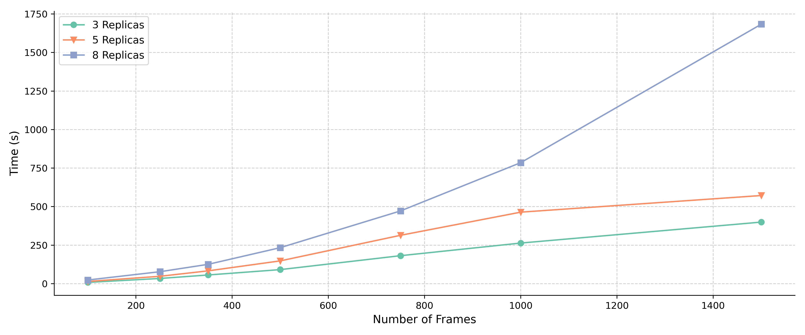
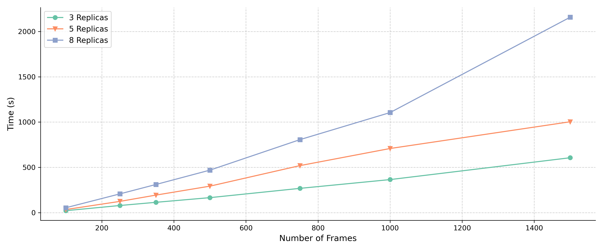

Performances
==================

.. raw:: html

   

   

To give an idea of NetMD's performance, we present the results from several runs on a machine equipped with 24 GB of RAM and a 13th Gen Intel(R) Core(TM) i7-13700F (2.10 GHz) CPU.

The experiments were run with different numbers of replicas (3, 5, and 8), different numbers of frames (100, 250, 350, 500, 750, 1000, and 1500), and two types of scale-free graphs (with a density of 0.01 and 0.03), each composed of 447 nodes. We used three Weisfeiler-Lehman iterations for the Graph2Vec embedding. The value reported in each cell is the mean ± the standard deviation over five runs.

====
Time
====

The table show the time performance in seconds for graphs with density of 0.01 (890 edges on average) on different number of replicas and frames.

.. list-table:: Time Performance in seconds for graph of density 0.01
    :header-rows: 1
    :widths: 5 10 10 10 10 10 10 10

    * - Replicas
      - 100
      - 250
      - 350
      - 500
      - 750
      - 1000
      - 1500
    * - 3
      - 8.42 ± 0.05
      - 33.9 ± 0.24
      - 56.49 ± 0.75
      - 91.31 ± 2.73
      - 181.66 ± 1.41
      - 263.69 ± 4.21
      - 399.63 ± 12.52
    * - 5
      - 14.8 ± 0.04
      - 48.05 ± 0.34
      - 83.3 ± 0.83
      - 148.05 ± 1.87
      - 314.0 ± 3.31
      - 464.22 ± 12.25
      - 572.09 ± 3.68
    * - 8
      - 23.87 ± 0.13
      - 77.69 ± 1.66
      - 125.48 ± 0.99
      - 233.66 ± 2.37
      - 472.09 ± 3.68
      - 785.42 ± 12.19
      - 1683.59 ± 26.17

The table show the time performance in seconds for graphs with density of 0.03 (3080 edges on average) on different number of replicas and frames.

.. list-table:: Time Performance in seconds for graph of density 0.03
    :header-rows: 1
    :widths: 5 10 10 10 10 10 10 10

    * - Replicas
      - 100
      - 250
      - 350
      - 500
      - 750
      - 1000
      - 1500
    * - 3
      - 21.02 ± 0.3
      - 78.28 ± 0.83
      - 113.5 ± 0.92
      - 165.16 ± 2.96
      - 267.74 ± 11.21
      - 364.58 ± 16.12
      - 605.97 ± 14.14
    * - 5
      - 33.62 ± 0.15
      - 123.72 ± 4.87
      - 193.07 ± 2.22
      - 292.03 ± 11.32
      - 519.08 ± 17.92
      - 707.92 ± 19.73
      - 1003.39 ± 22.49
    * - 8
      - 53.39 ± 0.21
      - 206.6 ± 10.12
      - 310.33 ± 16.97
      - 469.0 ± 23.43
      - 806.09 ± 16.34
      - 1104.83 ± 29.63
      - 2158.54 ± 21.27

=======
Memory
=======

Another crucial aspect of performance is memory usage. NetMD's memory consumption was monitored during the execution of the same experiments described above. The peak memory usage observed during these runs is summarized in the table below.

The **peak memory** performance in MB for graphs with density of 0.01 (890 edges on average) on different number of replicas and frames is shown in the table below.

.. list-table:: Memory Performance in MB for graph of density 0.01 (transposed)
  :header-rows: 1
  :widths: 10 10 10 10

  * - Frames
    - 3 Replicas
    - 5 Replicas
    - 8 Replicas
  * - 100
    - 664.75 ± 33.0
    - 724.16 ± 46.1
    - 865.21 ± 32.42
  * - 250
    - 1382.99 ± 59.52
    - 1530.26 ± 77.41
    - 1797.31 ± 51.31
  * - 350
    - 1867.43 ± 24.96
    - 2126.37 ± 34.69
    - 2399.34 ± 60.04
  * - 500
    - 2606.54 ± 134.81
    - 2968.52 ± 108.13
    - 3450.45 ± 97.24
  * - 750
    - 3724.95 ± 129.68
    - 4361.8 ± 39.46
    - 5179.4 ± 85.95
  * - 1000
    - 4877.62 ± 138.49
    - 5578.15 ± 75.46
    - 6700.91 ± 187.6
  * - 1500
    - 7596.5 ± 80.1
    - 8443.25 ± 109.14
    - 9996.24 ± 87.52

The **peak memory** performance in MB for graphs with density of 0.03 (3080 edges on average) on different number of replicas and frames is shown in the table below.

.. list-table:: Memory Performance in MB for graph of density 0.03 (transposed)
  :header-rows: 1
  :widths: 10 10 10 10

  * - Frames
    - 3 Replicas
    - 5 Replicas
    - 8 Replicas
  * - 100
    - 968.8 ± 63.98
    - 1100.4 ± 36.65
    - 1300.72 ± 46.53
  * - 250
    - 2590.53 ± 47.25
    - 2782.65 ± 26.02
    - 2915.13 ± 23.33
  * - 350
    - 3340.72 ± 37.98
    - 4910.78 ± 16.51
    - 7589.91 ± 38.95
  * - 500
    - 5080.23 ± 1.26
    - 5590.31 ± 21.81
    - 8762.19 ± 35.13
  * - 750
    - 5443.81 ± 0.52
    - 7733.0 ± 1.15
    - 9262.27 ± 4.45
  * - 1000
    - 7206.91 ± 3.15
    - 8583.17 ± 0.47
    - 18092.9 ± 1.83
  * - 1500
    - 12691.36 ± 2.56
    - 15860.91 ± 23.84
    - 22979.2 ± 214.02
